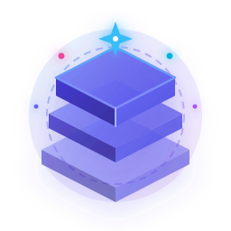

<p align="center">
  <a href="https://github.com/atengk/vitepress-zenith">
    
  </a>
</p>

<h1 align="center">VitePress Zenith</h1>

<p align="center">
  <strong>现代化顶配旗舰级技术文档、知识库与技术博客矩阵模板</strong>
</p>

<p align="center">
  开箱即用集成沉浸式专注阅读 (Zen Mode)、Shiki Twoslash 动态类型、全局快捷命令中心、Markmap 思维导图、全能富媒体可视化与全站包管理器联动
</p>

<p align="center">
  <a href="https://github.com/atengk/vitepress-zenith/blob/master/LICENSE">
    
  </a>
  <a href="https://nodejs.org/">
    
  </a>
  <a href="https://pnpm.io/">
    
  </a>
  <a href="https://vitepress.dev/">
    
  </a>
  <a href="https://vuejs.org/">
    
  </a>
  <a href="https://github.com/atengk/vitepress-zenith/actions">
    
  </a>
</p>

---

## 🌟 为什么选择 VitePress Zenith？

在搭建企业级或现代化个人技术文档与知识库时，基于原生 VitePress 往往需要耗费大量时间集成周边插件（如代码悬浮类型、思维导图、全站包管理器切换、灯箱、离线检索、命令中心等），并且经常遭遇样式穿透、依赖冲突、深色模式失调以及移动端适配等痛点。

**VitePress Zenith（天顶）** 正是为此而生：
- 🎯 **开箱即用**：零额外配置，拉取即拥有业界标杆级的设计与交互。
- 💎 **美学天花板**：融合毛玻璃、渐变高光微光、呼吸动效、4 套品牌强调色与白皮书级打印排版。
- 🛠️ **全链路工程生态**：内置 CI/CD、自动生成多级侧边栏、免导入交互组件库与可插拔功能开关矩阵。
- 📶 **离线优先 (PWA)**：断网毫秒级秒开、全站资源自动预缓存与桌面端原生安装体验。

---

## 🚀 12 大杀手级核心特性

| 特性板块 | 说明 |
| :--- | :--- |
| 🎯 **沉浸式专注阅读 (Zen Mode)** | 双侧边栏对称硬件加速展翼平移，加宽至 1180px 黄金阅读画布。支持全局快捷键（`Alt + Z`）与偏好持久化。 |
| ⚡ **Shiki Twoslash 动态类型悬浮** | 在网页代码块中体验 VS Code 级代码悬浮类型推导（`// ^?`）与 TypeScript 编译器语法即时诊断。 |
| ⌨️ **全局交互命令中心 (Command Palette)** | 类似 macOS Spotlight 与 Raycast，按 <kbd>Ctrl</kbd>/<kbd>⌘</kbd> + <kbd>K</kbd> 或 <kbd>/</kbd> 唤起全文检索与全局快捷动作。 |
| 🎨 **4 套品牌强调色动态切换** | 支持经典紫蓝 (Indigo)、极客翠绿 (Emerald)、炽热赤红 (Crimson) 与日光暖金 (Amber) 即时切换与防闪烁加载。 |
| 📦 **全站联动包管理器选项卡** | 支持 `npm` / `pnpm` / `yarn` / `bun` 一键切换，全站跨页面状态实时无缝同步。 |
| 🔗 **站内内链卡片即时悬浮预览** | 鼠标悬浮站内链接自动弹出上下文卡片摘要与首个标题，提供类似 Wikipedia / Notion 的沉浸式阅读流。 |
| 📶 **PWA 渐进式离线应用与预缓存** | Service Worker 离线全站缓存，弱网/断网秒开，桌面安装横幅，外部流媒体离线优雅降级兜底。 |
| 📐 **全能富媒体与架构可视化** | 原生支持 LaTeX 数学公式、Mermaid 架构流程图、Markmap 交互思维导图与 Medium-zoom 图片全屏灯箱。 |
| 🎬 **自适应多媒体短代码组件** | 封装免 import 的 `<VpImage>`（深浅双模图自适应）、`<VpVideo>`（自适应 MP4）、`<VpBilibili>` 与 `<VpYouTube>`。 |
| 🎛️ **可插拔功能开关矩阵 (`zenithConfig`)** | 在 `config.ts` 集中管控全站 16 项特性开闭，高干扰与无后端特性默认静默，页面 Frontmatter 绝对覆盖。 |
| ⌨️ **全键盘极客导航与速查表** | 按 <kbd>?</kbd> 唤出全键盘速查浮层，支持 <kbd>J</kbd>/<kbd>K</kbd> 翻页、<kbd>T</kbd> 换肤、<kbd>Alt+Z</kbd> 专注模式纯键盘掌控。 |
| 📰 **技术博客、多语言与多版本** | 包含博客时间轴标签筛选流、基于 GitHub Discussions 的 Giscus 评论区、多语言矩阵与历史归档横幅。 |

---

## 🛠️ 快速起步

### 1. 环境准备

确保您的本地开发环境满足以下要求：
- [Node.js](https://nodejs.org/) `>= 20.0.0`
- [pnpm](https://pnpm.io/) `>= 9.0.0`

### 2. 克隆与安装

```bash
# 克隆仓库
git clone https://github.com/atengk/vitepress-zenith.git

# 进入项目目录
cd vitepress-zenith

# 安装依赖
pnpm install
```

### 3. 本地开发与实时预览

```bash
# 启动 VitePress 开发服务器（支持热重载，默认端口 5173）
pnpm dev

# 严格类型诊断检查
pnpm typecheck
```

本地服务启动后，在浏览器访问 [http://localhost:5173](http://localhost:5173) 即可实时查阅。

### 4. 生产编译与预览

```bash
# 编译全站静态产物（输出至 docs/.vitepress/dist）
pnpm build

# 本地启动预览服务器验证生产产物
pnpm preview
```

---

## 🎛️ 特性开关矩阵 (`themeConfig.zenith`)

Zenith 采用可插拔开关矩阵架构，所有特性均可在 `docs/.vitepress/config.ts` 顶部集中管控：

```ts
const zenithConfig = {
  // 1. 进阶/特定场景特性（默认关闭，按需开启）
  i18n: false,              // 国际化多语言矩阵（关闭时不显示顶栏语言切换）
  versionSwitcher: false,   // 多版本管理与归档横幅（关闭时不显示版本下拉菜单）
  helpful: false,           // 文档有用度评价（无后端埋点占位组件）
  zenModeToggle: false,     // 右下角专注模式悬浮球（快捷键 Alt+Z 仍可直接使用）
  contributors: false,      // 开源贡献者致谢流（单人/私有项目免受侵扰）

  // 2. 旗舰体验特性（做成开关，默认开启，可一键关闭）
  banner: true,             // 顶部全宽公告通知横幅
  themePicker: true,        // 顶栏主题强调色盘选择器
  commandPalette: true,     // 全局快捷命令中心浮层 (Ctrl+K / /)
  blog: true,               // 博客系统与导航入口
  pwaStatus: true,          // PWA 离线运行感知与安装横幅
  mediumZoom: true,         // 正文插图平滑点击放大灯箱
  readingMetrics: true,     // 阅读认知指标（字数与耗时估算）
  readingProgressBar: true, // 页面顶部流光阅读进度条
  linkPreview: true,        // 站内内链卡片悬浮即时预览
  keyboardShortcuts: true,  // 全键盘极客导航与速查浮层
  codeFolding: true,        // 超长代码块（>25行）平滑折叠
}
```

> **页面级覆盖**：任意 Markdown 页面均可通过 Frontmatter 覆盖全局开关（如 `helpful: true` 或 `readingMetrics: false`）。

---

## 🧩 内置交互短代码组件库 (Auto-registered Shortcodes)

在任意 Markdown 文档中均可**直接调用以下组件，无需手动 import**：

| 组件标签 | 使用范例 | 核心功能与应用场景 |
| :--- | :--- | :--- |
| `<VpCardGrid>` & `<VpCard>` | `<VpCardGrid :cols="3"><VpCard title="..." icon="i-lucide-zap" /></VpCardGrid>` | 响应式多列自适应网格与悬浮高光卡片 |
| `<VpBadge>` | `<VpBadge type="tip" dot>默认推荐</VpBadge>` | 6 种语义色与 3 种变体的状态胶囊徽标 |
| `<VpTimeline>` | `<VpTimeline><VpTimelineItem date="..." title="...">...</VpTimelineItem></VpTimeline>` | 版本演进路线图、更新日志与大事件时间线 |
| `<VpLinkCard>` | `<VpLinkCard title="..." link="..." icon="i-lucide-external-link" />` | 推荐关联资源、参考手册与外部链接卡片 |
| `<VpDemoPreview>` | `<VpDemoPreview title="..." :code="...">...</VpDemoPreview>` | 交互运行态沙箱、源码折叠与一键试跑 |
| `<VpApiTable>` | `<VpApiTable><VpApiItem name="src" type="string" required desc="..." /></VpApiTable>` | 结构化参数契约表，支持移动端卡片式自适应 |
| `<VpPlayground>` | `<VpPlayground :files="{ 'index.ts': '...' }" />` | 一键投送 WebContainer 虚拟机秒级试跑 |
| `<VpContributors>` | `<VpContributors :contributors="[...]" />` | 基于 Git 提交历史的贡献者头像行与协作入口 |
| `<VpBlogList>` | `<VpBlogList />` | 博客专栏分类标签无刷新过滤与文章卡片流 |
| `<VpImage>` | `<VpImage light="..." dark="..." caption="..." />` | 浅色/深色主题双图自适应切换与居中图注 |
| `<VpVideo>` | `<VpVideo src="..." poster="..." caption="..." />` | 自适应 16:9 高质感视频播放器与离线兜底 |
| `<VpBilibili>` | `<VpBilibili bvid="BV1xx411c7mD" />` | B站视频自适应嵌入，默认关闭弹幕防打扰 |
| `<VpYouTube>` | `<VpYouTube id="dQw4w9WgXcQ" />` | 官方隐私增强模式国际化视频流嵌入 |

---

## 📁 项目架构与目录结构

```text
vitepress-zenith/
├── .github/
│   └── workflows/
│       └── deploy.yml          # GitHub Actions 自动化构建与 GitHub Pages 部署
├── docs/                       # 文档与博客源码目录
│   ├── .vitepress/             # VitePress 核心配置与定制主题
│   │   ├── config.ts           # 站点核心配置、开关矩阵、多语言与插件集成
│   │   ├── theme/              # 主题定制层
│   │   │   ├── components/     # 全局交互短代码组件库 (VpCard, VpVideo, ZenMode 等)
│   │   │   ├── composables/    # 状态控制组合式函数 (useZenMode, useThemePalette 等)
│   │   │   ├── styles/         # 全局增强样式、色盘、代码折叠与打印规范
│   │   │   ├── index.ts        # 主题入口与组件全局注册
│   │   │   └── Layout.vue      # 根布局插槽装配与特性挂载
│   │   └── utils/              # 自动化侧边栏生成、离线索引与工具函数
│   ├── adr/                    # 架构决策记录 (ADR-0001 ~ ADR-0009)
│   ├── blog/                   # 技术博客文章矩阵（标签筛选与时间线归档）
│   ├── components/             # 交互短代码组件总览与使用范例
│   ├── guide/                  # 基础指南与深度特性文档 (Zen Mode, Twoslash, PWA 等)
│   ├── public/                 # 静态资源（矢量 Logo、PWA 图标与深浅模式演示图）
│   └── index.md                # 首页 Hero 落地页
├── CONTEXT.md                  # 核心领域语言定义与术语规范 (Ubiquitous Language)
├── AGENTS.md                   # 仓库级 AI Agent 协同行为准则与架构约定
├── package.json                # 项目依赖与执行脚本
├── tsconfig.json               # TypeScript 严格模式配置
├── uno.config.ts               # UnoCSS 原子类与 Lucide 图标集预设
└── README.md                   # 项目核心说明文档
```

---

## 🚢 自动化 CI/CD 与部署

项目内置了完整的 GitHub Actions 工作流（位于 `.github/workflows/deploy.yml`）。

当代码推送或合并至 `master` / `main` 分支时，自动化工作流将依次执行：
1. 检出代码并恢复 pnpm 依赖缓存；
2. 运行 `pnpm run typecheck` 校验 TypeScript 语法与类型安全；
3. 执行 `pnpm run build` 构建生产级静态文档；
4. 自动上传产物并部署至 **GitHub Pages**。

---

## 📄 开源许可证

本项目基于 [MIT 许可证](./LICENSE) 开源发布，欢迎自由使用、商业应用与二次定制。
