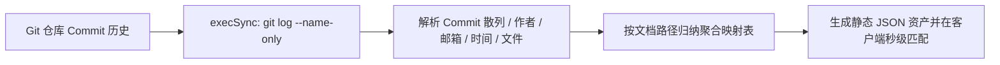

# 开源贡献者致谢流与 GitHub 协同 (Contributors Stream)

开源的精髓在于**全球开发者的协同共建**。每一份文档的错别字修正、每一处 API 参数说明的补充、每一个最佳实践案例的提交，都凝聚着开源贡献者的心血。

如果文档系统只是冷冰冰地展示内容，缺乏对贡献者的即时反馈与荣誉激励，社区的共建活力便会逐渐衰减。

**VitePress Zenith** 引入了工业级**开源贡献者致谢流 (`<VpContributors>`)** 与 **GitHub 编辑协同体系**：
1. **构建期 Git 提交自动挖掘**：在编译打包阶段自动解析当前 Markdown 文档的真实 Git Commit 历史，提取贡献者姓名、邮箱、提交次数与最新变更摘要。
2. **重叠头像流与悬浮卡片**：在文档底部生成美观的重叠头像流，悬浮展示贡献详情，点击直达 GitHub 个人主页。
3. **在 GitHub 上编辑此页**：醒目的协同入口，引导读者一键跳转 GitHub 网页端发起 Pull Request。

---

## 交互效果演示

下面是 `<VpContributors>` 组件在正文中的渲染效果（同时也已自动挂载至全站所有文档底部的“文档反馈”之后）：

<VpContributors
  title="本篇核心贡献团队"
  :contributors="[
    {
      name: '孔余 (Ateng)',
      avatar: 'https://github.com/atengk.png',
      github: 'atengk',
      commitsCount: 12,
      lastCommitTime: 1790346106,
      lastCommitMessage: 'feat(contributors): 构建 Git 历史贡献者提取与协同体系'
    },
    {
      name: 'VitePress Community',
      avatar: 'https://api.dicebear.com/7.x/identicon/svg?seed=VitePress',
      commitsCount: 3,
      lastCommitTime: 1790345000,
      lastCommitMessage: 'docs: 优化参数表与多语言排版规范'
    }
  ]"
  edit-url="https://github.com/atengk/vitepress-zenith/edit/master/docs/guide/contributors-stream.md"
/>

::: tip 生产环境全自动提取
在日常编写文档时，您**无需**手动填写任何贡献者数据。每当您执行 `git commit` 并提交文档修改后，Zenith 的构建加载器会自动从 Git 历史中聚合所有参与修改本页的作者，并按提交权重从高到低自动排列。
:::

---

## 核心技术架构与机制

### 1. 编译期 Git 日志提取引擎 (`contributors.data.ts`)

为了追求极限的运行时性能，Zenith 不在浏览器前端发起任何高耗时的 Git API 网络请求，而是利用 VitePress 的构建期数据加载器（`createContentLoader`），在 Node.js 环境中执行一次性增量日志挖掘：



```ts
// docs/.vitepress/theme/utils/contributors.data.ts
export default createContentLoader('**/*.md', {
  includeSrc: false,
  render: false,
  transform(rawData) {
    // 1. 批量提取 Git 日志并按文件聚合作者与提交次数
    // 2. 关联 GitHub 头像与 Gravatar 镜像
    // 3. 支持 Frontmatter 覆盖与增量拓展
    return resultMap
  },
})
```

---

### 2. 头像与 GitHub 主页智能解析

对于提取出的作者，组件采用多层递进的高可用头像解析策略：

1. **核心开发者字典**：配置已知核心作者的 GitHub Handle 与高清官方头像；
2. **邮箱散列映射**：采用全球可访问的 WeAvatar / Gravatar 服务，基于作者 Git 提交邮箱的 MD5 散列自动生成开发者头像；
3. **零网络 SVG 矢量兜底**：若无公开邮箱，自动通过 DiceBear / 矢量生成算法基于作者姓名派生独一无二的极客头像，保证在断网或内网局域网环境下 100% 渲染无白块。

---

### 3. Frontmatter 显式自定义与覆盖

如果某些团队贡献并未体现在 Git 记录中（例如设计评审、产品架构师或跨组织顾问），可在 Markdown 顶部的 Frontmatter 中显式声明：

```markdown
---
title: 我的技术文档
author: Ateng
contributors:
  - name: 外部审阅专家
    github: reviewer-expert
    avatar: https://avatars.githubusercontent.com/u/10001
---

# 我的技术文档
正文内容...
```

若某篇特定文档不希望展示贡献者组件，可直接配置 `contributors: false` 予以全局抑制。

---

### 4. 深度协同：在 GitHub 上编辑此页

在 `docs/.vitepress/config.ts` 中配置 `editLink`，可自由指定各语言分支的编辑链接模板：

```ts
// docs/.vitepress/config.ts
export default defineConfig({
  themeConfig: {
    editLink: {
      pattern: 'https://github.com/atengk/vitepress-zenith/edit/master/docs/:path',
      text: '在 GitHub 上编辑此页',
    },
  },
})
```

模板中的 `:path` 占位符会在渲染时自动被当前页面的物理相对路径（如 `guide/contributors-stream.md`）替换，读者点击即可直达 GitHub Web 编辑器，修改完直接提交 PR，形成极致顺滑的开源共建飞轮。

---

## 组件 API 契约

`<VpContributors>` 开放了灵活的属性配置：

<VpApiTable>
  <VpApiItem
    name="contributors"
    type="ContributorInfo[]"
    default="undefined"
    description="手动传入贡献者列表。若未传入，将自动从 contributors.data.ts 编译期生成的元数据中按当前路由推导。"
  />
  <VpApiItem
    name="editUrl"
    type="string"
    default="undefined"
    description="覆盖当前页面的 GitHub 编辑链接。未传入时将根据 themeConfig.editLink 模板与当前文档相对路径自动插值生成。"
  />
  <VpApiItem
    name="showEditLink"
    type="boolean"
    default="true"
    description="是否在贡献者列表右侧展示「在 GitHub 上编辑此页」跳转按钮。"
  />
  <VpApiItem
    name="title"
    type="string"
    default="'本页贡献者'"
    description="模块标题文案，支持随站点当前语言自动适配中英文。"
  />
</VpApiTable>

---

## 开源协同收益

- **社区荣誉沉淀**：每次 PR 无论大小，贡献者头像都将永久镌刻于文档末尾；
- **真实审计追踪**：读者悬浮即可获知文档最新由谁维护、变更内容为何，信息可信度倍增；
- **协同飞轮加速**：极低的编辑门槛，让读者随手提 PR 成为本能。
