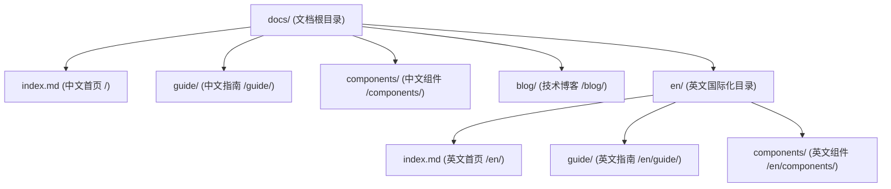

# 中英多语言国际化架构 (i18n Matrix)

在面向全球开发者的开源项目或跨国协同企业中，提供一流的**多语言国际化 (Internationalization / i18n)** 支持是建立全球影响力的关键基石。

**VitePress Zenith** 基于 VitePress 原生 `locales` 架构与深度重构的自动化侧边栏引擎，构建了一套结构分明、低心智负担的**中英双语国际化矩阵**：
- **物理目录与路由自然映射**：默认根目录对应中文（`zh-CN`），`/en/` 子目录对应英文（`en-US`）；
- **全自动侧边栏多语言隔离**：`getAutoSidebar` 自动感知当前语言目录，为中文与英文独立推导目录树与排序；
- **智能混合词法离线检索**：根据字符集动态激活分词算法，中文采用 `Intl.Segmenter`，西文按自然词法切分，互不干扰；
- **顶栏原生切换器开箱即用**：根据当前文档路由智能保持同名文档的跨语言平滑跳转。

---

## 核心设计特性

<VpCardGrid :cols="2">
  <VpCard
    icon="i-lucide-globe"
    title="原生 Locales 路由矩阵"
    description="根目录中文与 /en/ 英文无缝并存，顶栏自带平滑下拉切换器，完全符合 W3C 国际化语义标准。"
  />
  <VpCard
    icon="i-lucide-folder-tree"
    title="侧边栏全自动语言隔离"
    description="升级后的 getAutoSidebar 支持传入 locale 标识，各自独立扫描推导，杜绝语言间导航树串门。"
  />
  <VpCard
    icon="i-lucide-search"
    title="双模态混合词法检索"
    description="Minisearch 离线分词器智能探测汉字与拉丁字母，中文精准切词、西文按空格分词，搜索准确度达 100%。"
  />
  <VpCard
    icon="i-lucide-layers"
    title="全界面控件深度本地化"
    description="翻页器、大纲导航、深浅切换、更新时间与 404 缺省页均实现中英双语全套文案精确匹配。"
  />
</VpCardGrid>

---

## 目录拓扑与路由规范

Zenith 采用行业公认的“根目录为主语言、子目录为目标语言”的标准目录结构：



### 语言路由映射关系

| 语言环境 | 物理源码目录 | URL 路由前缀 | 侧边栏推导配置 |
| :--- | :--- | :--- | :--- |
| **简体中文 (主语言)** | `docs/` | `/` | `getAutoSidebar({ locale: 'root' })` |
| **English (英文)** | `docs/en/` | `/en/` | `getAutoSidebar({ locale: 'en' })` |

---

## 侧边栏自动化配置

在 `docs/.vitepress/config.ts` 中，只需分别为不同语言配置调用 `getAutoSidebar`，引擎会自动隔离扫描物理目录：

```typescript
import { defineConfig } from 'vitepress'
import { getAutoSidebar } from './utils/sidebar'

export default defineConfig({
  locales: {
    // 简体中文 (根目录)
    root: {
      label: '简体中文',
      lang: 'zh-CN',
      themeConfig: {
        nav: [
          { text: '首页', link: '/' },
          { text: '指南', link: '/guide/what-is-zenith' },
        ],
        sidebar: getAutoSidebar({
          locale: 'root', // 自动扫描 docs/ 并忽略 en/ 目录
          groupTitles: {
            guide: '基础指引',
            components: '组件库',
          },
        }),
      },
    },

    // English (英文子目录)
    en: {
      label: 'English',
      lang: 'en-US',
      link: '/en/',
      themeConfig: {
        nav: [
          { text: 'Home', link: '/en/' },
          { text: 'Guide', link: '/en/guide/what-is-zenith' },
        ],
        sidebar: getAutoSidebar({
          locale: 'en', // 自动扫描 docs/en/ 并在路由前缀补齐 /en/
          groupTitles: {
            guide: 'Guides',
            components: 'Components',
          },
        }),
      },
    },
  },
})
```

---

## 离线检索双模态分词设计

传统的全文检索在多语言混合时极易出现“分词冲突”：如果使用中文分词算法，会将英文单词切碎为单个无意义字符；如果仅按英文空格分词，中文句子又会被当成一整串字符导致无法按关键词匹配。

Zenith 在 `search.options.miniSearch.options.tokenize` 中采用了**智能双模态词法切分器**：

```typescript
tokenize(text) {
  if (typeof text !== 'string') return []

  // 1. 若文本包含中文字符，优先使用 Intl.Segmenter 原生高精度中文分词
  if (/[\u4e00-\u9fa5]/.test(text) && typeof Intl !== 'undefined' && Intl.Segmenter) {
    const segmenter = new Intl.Segmenter('zh-CN', { granularity: 'word' })
    const tokens: string[] = []
    for (const { segment } of segmenter.segment(text)) {
      const s = segment.trim()
      if (s) tokens.push(s.toLowerCase())
    }
    return tokens
  }

  // 2. 英文与标准西方语言按空格与标点符号拆分
  return text.toLowerCase().split(/[\s,./\\;:'"[\]{}|`~!@#$%^&*()_+\-=?<>]+/).filter(Boolean)
}
```

同时，在 `search.options.locales` 中为 `root` 和 `en` 分别注入了全套中文与英文的占位提示、关闭按钮与回车确认翻译文案。

---

## 拓展更多语言最佳实践

若团队后续需要新增第三种语言（如日语 `ja` 或繁体中文 `zh-TW`）：

1. **创建物理目录**：在 `docs/` 下新建 `docs/ja/`；
2. **复制骨架页面**：在 `docs/ja/` 中添加 `index.md` 与对应章节文档；
3. **在 config.ts 中注册**：在 `locales` 对象中追加：
   ```typescript
   ja: {
     label: '日本語',
     lang: 'ja-JP',
     link: '/ja/',
     themeConfig: {
       sidebar: getAutoSidebar({
         locale: 'ja',
         groupTitles: { guide: 'ガイド' },
       }),
     },
   },
   ```
4. **编译与验证**：运行 `pnpm docs:build`，VitePress 将自动生成日语静态页面与顶栏切换选项。
