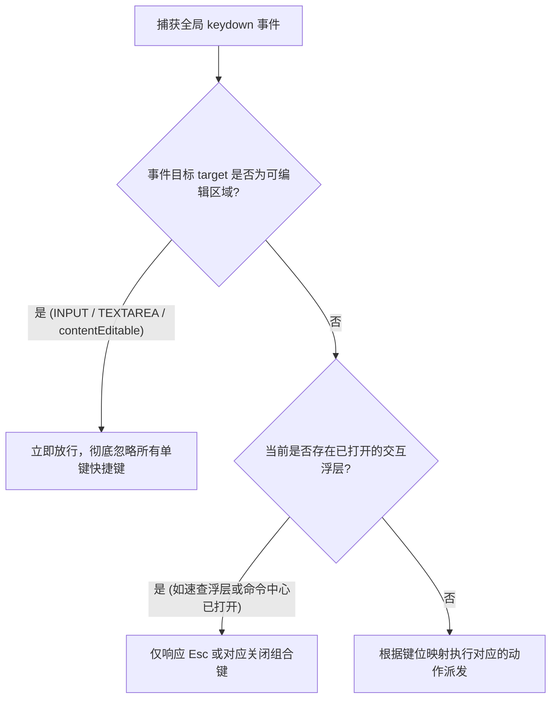

# 全键盘极客导航与快捷键速查 (Keyboard Shortcuts)

对于资深开发者、架构师与技术极客而言，**手不离键盘**是沉浸式阅读与查阅技术文档时的最高境界。频繁移动右手去握持鼠标不仅打断思维心流，也会在长时间翻阅几十篇长文档时加重操作疲劳。

借鉴 **GitHub**、**Linear** 与 **Superhuman** 等顶级现代开发者工具的交互哲学，**VitePress Zenith** 引入了开箱即用的**全键盘极客导航系统**与**快捷键速查中心 (<kbd>?</kbd> Cheat Sheet)**。

---

## 快捷键完整速查矩阵

随时按下键盘上的 <kbd>?</kbd>（或 <kbd>Shift</kbd> + <kbd>/</kbd>）即可在任意页面呼出如下速查面板。您也可以直接在此查阅全站键位映射表：

| 快捷键位 | 操作行为与目标 | 适用场景与详细说明 |
| :--- | :--- | :--- |
| <kbd>?</kbd> 或 <kbd>Shift</kbd>+<kbd>/</kbd> | **呼出 / 关闭快捷键速查** | 随时在屏幕中央唤起高质感快捷键速查中心浮层 |
| <kbd>Ctrl</kbd>/<kbd>⌘</kbd> + <kbd>K</kbd> 或 <kbd>/</kbd> | **唤起全局交互命令中心** | 调出支持离线全文检索、动作派发与页面直达的 Command Palette |
| <kbd>J</kbd> | **连贯翻至下一篇文章** | 遵循 Vim 经典操作习惯，自动聚焦并平滑导航至下一章节 |
| <kbd>K</kbd> | **连贯翻至上一篇文章** | 自动聚焦并平滑导航至上一章节，实现免鼠标连贯翻阅 |
| <kbd>T</kbd> | **一键切换深色 / 浅色模式** | 毫秒级无感切换主题外观，无需移至顶栏寻找切换开关 |
| <kbd>Alt</kbd> + <kbd>Z</kbd> 或 <kbd>Alt</kbd>+<kbd>F</kbd> | **沉浸式专注阅读 (Zen Mode)** | 彻底隐去顶栏与双侧边栏，聚焦 1240px 舒展纯净黄金版心 |
| <kbd>Ctrl</kbd>/<kbd>⌘</kbd> + <kbd>P</kbd> | **白皮书级纯净打印当前文档** | 自动剥离侧边栏与辅助浮层，调起浏览器高规格 PDF 打印排版 |
| <kbd>Esc</kbd> | **退出 / 关闭活动浮层与模式** | 统一关闭速查面板、命令中心、内链预览或退出沉浸专注阅读模式 |

::: tip 立即尝试
现在就请随手敲下键盘上的 <kbd>?</kbd> 键（或按下 <kbd>T</kbd> 体验瞬时深浅换肤），体验行云流水的全键盘阅读交互！
:::

---

## 核心技术设计与架构

### 1. 输入焦点智能防误触防御 (Input Guard)

单键快捷键（如 <kbd>J</kbd>、<kbd>K</kbd>、<kbd>T</kbd>、<kbd>?</kbd>）的最大痛点在于：如果读者正在输入框搜索、在 Giscus 评论区打字或编辑表单时，单键很容易产生误触或乱码输入。

Zenith 在 `useKeyboardShortcuts` 调度器顶层内置了严格的**输入焦点守护过滤器**：



```ts
// docs/.vitepress/theme/composables/useKeyboardShortcuts.ts
function isEditingContent(event: KeyboardEvent): boolean {
  const target = event.target as HTMLElement | null
  if (!target) return false
  const tagName = target.tagName
  return (
    target.isContentEditable ||
    tagName === 'INPUT' ||
    tagName === 'SELECT' ||
    tagName === 'TEXTAREA'
  )
}
```

只有当确认用户不在任何文本编辑上下文中时，全局按键监听器才会执行动作分流。

---

### 2. 长文连贯翻页机制 (Vim Pager J / K)

在连载技术教程、API 规范手册或电子书式长篇阅读中，读者通常需要按顺序连续阅读。

当读者按下 <kbd>J</kbd> 时，引擎会自动从文档底部的真实 Pager 节点中提取下一页目标：

```ts
// 翻至下一篇
if ((event.key === 'j' || event.key === 'J') && !event.ctrlKey && !event.metaKey && !event.altKey) {
  const nextLink = document.querySelector('a.pager-link.next') as HTMLAnchorElement | null
  if (nextLink) {
    event.preventDefault()
    nextLink.click()
  }
}
```

当按下 <kbd>K</kbd> 时同理回退至上一篇，从而天然继承 VitePress 根据侧边栏树状拓扑推导的前后序逻辑，丝毫不破坏浏览历史记录。

---

### 3. 速查浮层组件 API 契约

`<VpShortcutsModal>` 采用声明式组件设计，默认由布局底部的单例状态自动驱动，同时也支持独立传参嵌入：

<VpApiTable>
  <VpApiItem
    name="visible"
    type="boolean"
    default="undefined"
    description="强制受控显隐状态。未配置时将自动订阅 useKeyboardShortcuts 单例状态并在按下 ? 时自动开闭。"
  />
</VpApiTable>

---

## 组合应用范式：极客极速巡检

结合 Zenith 的其他极客交互特性，您可以实现真正的“全键盘工作流”：

1. 打开文档按 <kbd>Alt</kbd> + <kbd>Z</kbd> 进入全屏专注阅读模式；
2. 阅读正文按 <kbd>J</kbd> 自动进入下一小节；
3. 需要检索新知识时按 <kbd>/</kbd> 或 <kbd>Ctrl+K</kbd> 调出命令中心，打字搜索；
4. 遇到夜间弱光环境敲下 <kbd>T</kbd> 瞬间切换为暗黑模式；
5. 阅读完毕按 <kbd>Ctrl+P</kbd> 直接导出排版规整的 PDF 离线存档。

全键盘驱动，让文档浏览兼具终极效率与愉悦触感。
