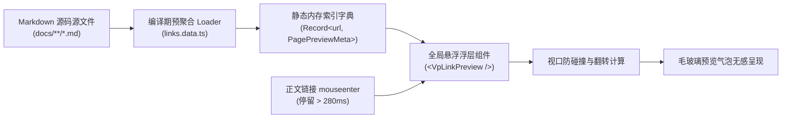

# 站内内链悬浮卡片预览 (Link Hover Preview)

深度技术知识库的一大特征在于**高度互联的概念网状结构**。然而，频繁的新标签页跳转极易打断读者的沉浸式思考流。VitePress Zenith 引入了类似 **Wikipedia / Notion / Obsidian** 的内链智能悬浮预览体系，当读者将光标停留于任何正文站内链接上方时，即刻弹出精美的即时上下文预览卡片。

---

## 1. 实机交互演示体验

您可以将鼠标光标悬浮在下方几个典型的站内文档链接上停留约 300 毫秒，观察平滑淡入的即时预览浮层，并尝试将光标移入卡片内部：

- 👉 [什么是 VitePress Zenith 核心愿景](./what-is-zenith.md)
- 👉 [超长代码块智能折叠与阅读体验](./reading-experience.md)
- 👉 [交互短代码组件库全景总览](../components/overview.md)
- 👉 [动态主题强调色盘与白皮书级纯净打印](./theme-and-print.md)

> [!TIP]
> 预览卡片呈现目标文档的**所属栏目徽标**、**预计阅读时长**、**主标题**、**首段核心概念摘要**以及**标准化 URL 路由**，点击卡片任何区域均可直接平滑直达。

---

## 2. 核心架构与工作原理解析

传统的客户端动态抓取或异步 `fetch` HTML 方案往往存在首屏卡顿、网络延迟、多余网络请求或 CORS 隐患。Zenith 采用了**编译期预聚合 + 客户端 O(1) 瞬时查询**的高性能架构：



### 1. 编译期元数据预提取 (`links.data.ts`)
借助 VitePress 原生 `createContentLoader` 机制，在构建期对全站 Markdown 文件执行词法分析：
- **标题推导**：优先读取 Frontmatter `title`，若未声明则自动提取正文首个 `#` 一级标题；
- **智能正文摘要提取**：自动剔除 Frontmatter、大纲标题、HTML 注释、图片语法与代码块，精准截取首个有意义的实质性文字段落（约 120 字），杜绝显示无意义代码语法；
- **多维指标量化**：自动统计字符数并推导阅读分钟数；
- **分类标签识别**：根据路由目录自动分配 `核心指南`、`交互组件库`、`技术专栏` 或 `架构决策 (ADR)` 等语义徽标。

---

## 3. 防抖悬浮与交互容差策略 (Hover Intent)

为了确保用户在日常滚动页面或快速划过文字时不受无谓干扰，预览系统设计了多重人机工效防抖规则：

| 交互阶段 | 时间阈值 | 设计意图与工程防护 |
| :--- | :--- | :--- |
| **悬浮触发防抖** | `280ms` | 读者必须在链接上方有意识地停留超过该阈值方才触发，完全杜绝鼠标扫过时的闪烁误触 |
| **移出保护宽限** | `160ms` | 当鼠标离开链接时提供短暂缓冲区，允许读者平滑将光标滑入卡片内部查看详情或点击 |
| **卡片悬留锁定** | 持续 | 只要光标处于浮层卡片区域内，卡片保持稳定激活，支持选中文本或直接点击跳转 |
| **移动触控隔离** | 原生豁免 | 自动检测 `pointer: coarse` 触控设备，手机/平板浏览时免除悬浮气泡，保证轻触即正常跳转 |

---

## 4. 智能视口碰撞与动态翻转定位

预览卡片采用标准的**动态几何计算与边缘自适应约束**：

```ts
// 核心定位伪代码逻辑
let left = rect.left + rect.width / 2 - CARD_WIDTH / 2
// 左右边界钳制：距屏幕两翼至少保持 16px 呼吸间距
if (left < 16) left = 16
if (left + CARD_WIDTH > viewportWidth - 16) left = viewportWidth - CARD_WIDTH - 16

// 上下翻转防御：默认居于链接上方，上方空间不足时自动翻转至下方呈现
let top = rect.top - estimatedHeight - 10
if (top < 16) {
  top = rect.bottom + 10 // 自动下翻
}
```

无论目标链接位于屏幕顶部、底部还是紧贴屏幕右边缘，浮层卡片均能稳定保持在最佳视觉可读区域内。

---

## 5. 链接类型智能过滤与防御

悬浮预览引擎仅针对**站内实质性知识文档**响应，具备完善的过滤机制：

- ❌ **绝对外链过滤**：自动忽略以 `http://`、`https://`、`//`、`mailto:` 开头的外部资源；
- ❌ **纯锚点过滤**：文档内部章节跳转（如 `#section-2`）直接交由原生锚点处理，不弹窗；
- ❌ **导航与控制台隔离**：顶部导航栏、左侧侧边栏、右侧大纲导读与调色盘等布局组件内的链接天然豁免；
- ❌ **自指链接规避**：若页面内链接指向当前阅读的页面本身，静默免除弹窗；
- ✅ **全形态相对路径支持**：无论是 `/guide/what-is-zenith`、`./what-is-zenith.md` 还是 `../components/overview`，均能在运行时毫秒级解析归一化为统一的字典 Key。

---

## 6. 全局无侵入挂载

在主题核心布局 `Layout.vue` 中，`<VpLinkPreview />` 已挂载于 `#layout-bottom` 全局插槽中。无需在编写 Markdown 时额外书写任何特殊短代码，所有普通的 Markdown 链接：

```markdown
[阅读架构选型](./what-is-zenith.md)
```

均会自动开箱即用获得 Wikipedia 级别的沉浸预览交互能力！
