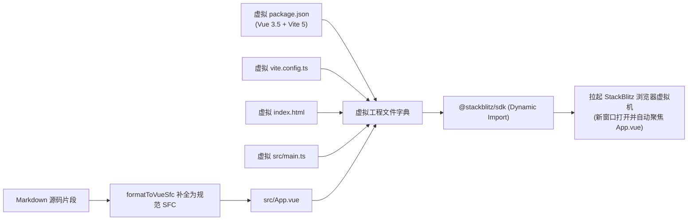

# 在线沙箱直达 (StackBlitz WebContainer)

在传统技术文档中，代码示例往往只能“静态阅读”或“手动复制到本地运行”。当读者想要调整一个 Props 参数或测试边界用例时，必须经历漫长的本地环境初始化：创建文件夹、安装包依赖、配置构建工具，最终往往因为环境差异或配置繁琐而放弃尝试。

**VitePress Zenith** 深度整合了全球领先的 **StackBlitz WebContainer** 浏览器虚拟机技术，为交互演示组件 `<VpDemoPreview>` 与独立沙箱卡片 `<VpPlayground>` 注入了**一键在线试跑与即时调试**能力。读者只需轻点鼠标，当前文档中的代码片段即可瞬间打包并投送至浏览器虚拟 Node.js 容器中极速运行，无需任何本地环境即可享受完整的 Vite + Vue 3 调试体验。

---

## 核心设计特性

<VpCardGrid :cols="2">
  <VpCard
    icon="i-lucide-zap"
    title="秒级 WebContainer 启动"
    description="利用 WebAssembly 在浏览器客户端沙箱中即时编译并运行 Vite 开发服务器，零远程服务端等待。"
  />
  <VpCard
    icon="i-lucide-package"
    title="动态虚拟工程自动构建"
    description="自动将 Markdown 中的代码片段包装为符合规范的微型 Vite + Vue 3 工程模板（含 package.json 与构建配置）。"
  />
  <VpCard
    icon="i-lucide-feather"
    title="按需动态载入 (0 首屏负担)"
    description="仅在读者实际点击「在 StackBlitz 试跑」时动态载入 SDK，全站首屏体积与 SSR 构建完全不受影响。"
  />
  <VpCard
    icon="i-lucide-toggle-left"
    title="精细化开关与自适应"
    description="支持通过属性随心开启或关闭试跑按钮，在纯展示代码或受限网络下无缝降级为一键复制代码。"
  />
</VpCardGrid>

---

## 实机效果演示

### 1. 交互演示工具栏一键投送 (VpDemoPreview)

在 `<VpDemoPreview>` 中，只要提供了 `code` 属性且未显式关闭试跑，工具栏右侧将自动呈现醒目的闪电试跑按钮：

<VpDemoPreview
  title="响应式颜色切换器"
  desc="点击右侧「在 StackBlitz 试跑」，体验在浏览器虚拟机中修改代码并秒级热重载"
  code="<script setup lang='ts'>
import { ref } from 'vue'

const color = ref('#6366f1')
const colors = ['#6366f1', '#10b981', '#f43f5e', '#f59e0b', '#06b6d4']
</script>

<template>
  <div style='padding: 28px; text-align: center;'>
    <div :style='{ backgroundColor: color, color: #fff, padding: 18px 24px, borderRadius: 12px, marginBottom: 16px, fontWeight: 600, transition: all 0.3s ease }'>
      当前选中颜色：{{ color }}
    </div>
    <div style='display: flex; gap: 8px; justify-content: center;'>
      <button
        v-for='c in colors'
        :key='c'
        :style='{ backgroundColor: c, width: 32px, height: 32px, borderRadius: 8px, border: none, cursor: pointer }'
        @click='color = c'
      />
    </div>
  </div>
</template>"
>
  <div style="display: flex; gap: 12px; align-items: center;">
    <VpBadge type="tip" dot>支持即时投送</VpBadge>
    <VpBadge type="purple" variant="solid">Vite + Vue 3</VpBadge>
    <span style="font-size: 13px; color: var(--vp-c-text-2);">点击右上角闪电图标即可在沙箱中运行</span>
  </div>

  <template #code>

```html
<script setup lang="ts">
import { ref } from 'vue'

const color = ref('#6366f1')
const colors = ['#6366f1', '#10b981', '#f43f5e', '#f59e0b', '#06b6d4']
</script>

<template>
  <div style="padding: 28px; text-align: center;">
    <div :style="{ backgroundColor: color, color: '#fff', padding: '18px 24px', borderRadius: '12px', marginBottom: '16px', fontWeight: 600 }">
      当前选中颜色：{{ color }}
    </div>
    <div style="display: flex; gap: 8px; justify-content: center;">
      <button
        v-for="c in colors"
        :key="c"
        :style="{ backgroundColor: c, width: '32px', height: '32px', borderRadius: '8px', border: 'none', cursor: 'pointer' }"
        @click="color = c"
      />
    </div>
  </div>
</template>
```

  </template>
</VpDemoPreview>

---

### 2. 独立沙箱启动卡片 (VpPlayground)

适合在长篇教程末尾作为“实战练习区”或“在线动手实验室”嵌入：

<VpPlayground
  title="Vue 3 响应式待办清单 (TodoMVC)"
  desc="开箱即用的轻量待办列表应用，点击按钮一键进入独立全屏开发环境，立即开始二次开发"
  code="<script setup lang='ts'>
import { ref } from 'vue'

interface Todo {
  id: number
  text: string
  done: boolean
}

const input = ref('')
const todos = ref<Todo[]>([
  { id: 1, text: '学习 VitePress Zenith 核心架构', done: true },
  { id: 2, text: '体验 StackBlitz WebContainer 即时沙箱', done: false },
  { id: 3, text: '配置全站离线 PWA 与暗黑模式', done: false },
])

const addTodo = () => {
  if (!input.value.trim()) return
  todos.value.push({ id: Date.now(), text: input.value.trim(), done: false })
  input.value = ''
}

const toggle = (todo: Todo) => {
  todo.done = !todo.done
}
</script>

<template>
  <div style='max-width: 480px; margin: 0 auto; padding: 24px; font-family: system-ui, sans-serif;'>
    <h3 style='margin-bottom: 16px; color: #6366f1;'>待办事务清单</h3>
    <div style='display: flex; gap: 8px; margin-bottom: 16px;'>
      <input
        v-model='input'
        placeholder='输入待办事项按回车添加...'
        style='flex: 1; padding: 8px 12px; border-radius: 6px; border: 1px solid #cbd5e1;'
        @keyup.enter='addTodo'
      />
      <button @click='addTodo' style='padding: 8px 16px; border-radius: 6px; background: #6366f1; color: #fff; border: none; cursor: pointer;'>
        添加
      </button>
    </div>
    <ul style='list-style: none; padding: 0; margin: 0;'>
      <li
        v-for='todo in todos'
        :key='todo.id'
        :style='{ display: flex, alignItems: center, gap: 8px, padding: 8px 0, borderBottom: 1px solid #f1f5f9, textDecoration: todo.done ? line-through : none, color: todo.done ? #94a3b8 : #1e293b, cursor: pointer }'
        @click='toggle(todo)'
      >
        <input type='checkbox' :checked='todo.done' />
        <span>{{ todo.text }}</span>
      </li>
    </ul>
  </div>
</template>"
/>

---

## 底层虚拟工程架构

当读者点击试跑按钮时，Zenith 底层的 `openInStackBlitz` 工具函数将在毫秒级完成虚拟文件系统的编排：



### 生成的微型工程文件清单

1. **`package.json`**：精简声明 `vue`、`vite`、`@vitejs/plugin-vue` 与 `typescript`，确保 WebContainer 无缓存冷启动时在 2 秒内完成极速 `pnpm install`；
2. **`vite.config.ts`**：注入标准 Vue 单文件组件解析插件；
3. **`index.html`**：带有 `<div id="app"></div>` 根挂载节点与 UTF-8 编码设置；
4. **`src/main.ts`**：标准的 `createApp(App).mount('#app')` 实例化引导入口；
5. **`src/App.vue`**：智能包装后的组件源码。若传入的代码不包含 `<template>`，算法会自动注入 `<script setup>` 与居中弹性容器，防范渲染失败。

---

## 组件参数契约与使用规范

### `<VpDemoPreview>` 沙箱增强属性

<VpApiTable title="VpDemoPreview Props (沙箱相关)" :showVersion="false">
  <VpApiItem
    name="code"
    type="string"
    description="组件源码文本。提供此项时才会激活代码复制与 StackBlitz 试跑按钮"
  />
  <VpApiItem
    name="stackblitz"
    type="boolean"
    default="true"
    description="是否在工具栏展示「在 StackBlitz 试跑」快捷按钮。设为 false 时将隐藏该按钮"
  />
  <VpApiItem
    name="playgroundTitle"
    type="string"
    description="在 StackBlitz 新窗口中展示的项目自定义标题，缺省时使用 demo title"
  />
</VpApiTable>

### `<VpPlayground>` 独立沙箱卡片属性

<VpApiTable title="VpPlayground Props" :showVersion="false">
  <VpApiItem
    name="code"
    type="string"
    required
    description="待运行的核心源码文本"
  />
  <VpApiItem
    name="title"
    type="string"
    default="'组件交互沙箱'"
    description="沙箱工程标题"
  />
  <VpApiItem
    name="desc"
    type="string"
    description="沙箱工程副标题或补充说明文字"
  />
  <VpApiItem
    name="badge"
    type="string"
    default="'WebContainer'"
    description="右上角显示的特性技术徽标"
  />
  <VpApiItem
    name="buttonText"
    type="string"
    default="'在 StackBlitz 试跑'"
    description="启动按钮文字"
  />
</VpApiTable>

---

## 最佳实践与注意事项

1. **样式隔离与作用域**：  
   建议在代码片段中显式采用 `<style scoped>`，防止多组件在沙箱中发生样式污染；
2. **网络隔离兜底**：  
   若读者身处企业内网防火墙之后导致无法访问 StackBlitz 域名，组件工具栏中的**一键复制代码**仍然完好可用，确保零阅读阻塞；
3. **二开引入第三方组件库**：  
   若您的文档需要为沙箱引入私有组件库或特定 npm 包，只需在 `docs/.vitepress/theme/utils/stackblitz.ts` 的 `createViteVueProjectFiles` 中为 `package.json` 的 `dependencies` 追加依赖声明即可。
