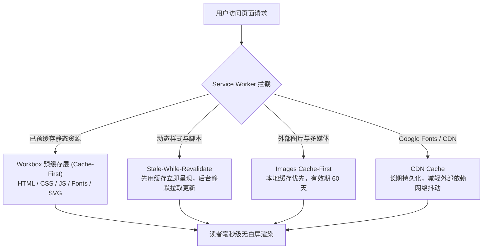

# PWA 渐进式离线应用与预缓存

在移动互联网与现代开发场景下，技术文档不仅仅是一组静态网页，更应当是开发者随时随地查阅、不受物理网络波动干扰的**随身技术手册**。

**VitePress Zenith** 深度集成了 `@vite-pwa/vitepress`，将全站一键升级为工业级 **渐进式 Web 应用 (Progressive Web App, PWA)**。在弱网、隧道、高铁甚至完全离线的飞行模式下，已访问或全站预缓存的文档页面依然支持**毫秒级秒开**；同时支持将文档一键“安装”至 macOS / Windows 桌面或 iOS / Android 移动端主屏幕，呈现全屏无地址栏干扰的原生桌面软件级体验。

---

## 核心特性一览

<VpCardGrid :cols="2">
  <VpCard
    icon="i-lucide-wifi-off"
    title="全站预缓存与离线断网秒开"
    description="构建期自动抽取全站 HTML、编译产物与静态资源，通过 Service Worker 本地持久化，断网环境下依然畅行无阻。"
  />
  <VpCard
    icon="i-lucide-monitor-down"
    title="桌面与移动端一键安装"
    description="完善配置 W3C Web App Manifest，支持 Chrome、Edge、Safari 等现代浏览器一键安装为独立运行的原生窗口应用。"
  />
  <VpCard
    icon="i-lucide-refresh-cw"
    title="静默静置更新 (Auto-Update)"
    description="采用 clientsClaim + skipWaiting 策略，当文档发布新版本时后台无缝预热换新，免除读者繁琐强制刷新操作。"
  />
  <VpCard
    icon="i-lucide-shield-alert"
    title="离线网络感知浮动指示"
    description="内置网络状态实时监听器，离线时优雅浮现断网提示胶囊，网络恢复后智能发送回联确认并平滑淡出。"
  />
</VpCardGrid>

---

## 离线感知与安装状态演示

Zenith 全局挂载了离线感知浮层 `<VpPwaStatus>`。当浏览器检测到网络断开时，页面底部会自动浮现半透明高斯模糊提示胶囊；当浏览器符合安装标准时，亦会主动提示读者一键安装。

<VpBanner type="tip" title="实机离线测试验证方法">
您无需真正拔掉网线即可测试此功能：
1. 打开浏览器开发者工具（快捷键 <kbd>F12</kbd> 或 <kbd>Cmd</kbd> + <kbd>Option</kbd> + <kbd>I</kbd>）；
2. 切换至 <strong>Network (网络)</strong> 面板；
3. 将网络节流下拉框从 <code>No throttling</code> 切换为 <code>Offline</code>；
4. 观察页面底部立即浮现的离线感知胶囊，并尝试在站内任意点击已预缓存的页面链接，体验毫秒级离线瞬开。
</VpBanner>

---

## 架构与缓存策略

Zenith 的 PWA 离线体系基于 Google Workbox 运行时构建，采用分层缓存拓扑设计：



### 1. 预缓存清单 (Precache Manifest)
在运行 `pnpm docs:build` 时，`@vite-pwa/vitepress` 会遍历输出目录，为每个 HTML 页面、JS 模块、CSS 样式表以及 `logo.svg` 等资产计算唯一的哈希指纹，并写入 `sw.js` 的预缓存清单中。首次加载站点时，Service Worker 会在后台下载并本地保存这些资产。

### 2. 运行时缓存 (Runtime Caching)
对于通过动态引入或第三方 CDN 加载的资源，Zenith 预置了针对性缓存规则：

| 资源类别 | 匹配规则 | 缓存策略 (Strategy) | 缓存容量与过期 |
| :--- | :--- | :--- | :--- |
| **样式与脚本** | `style` / `script` / `worker` | `StaleWhileRevalidate` | 最多 120 项，有效期 30 天 |
| **文档图片资源** | `image` (SVG / PNG / JPG / WebP) | `CacheFirst` | 最多 100 项，有效期 60 天 |
| **字体与样式库** | `fonts.googleapis.com` / `gstatic` | `StaleWhileRevalidate` | 最多 30 项，有效期 365 天 |
| **外部 CDN 依赖** | `cdn.jsdelivr.net` | `CacheFirst` | 最多 50 项，有效期 30 天 |

---

## 核心配置详解

Zenith 的 PWA 配置收敛于 `docs/.vitepress/config.ts` 中的 `withPwa` 包装器内，关键字段说明如下：

```typescript
import { defineConfig } from 'vitepress'
import { withPwa } from '@vite-pwa/vitepress'

const base = process.env.BASE_PATH || (process.env.CI ? '/vitepress-zenith/' : '/')

export default withPwa(defineConfig({
  base,
  pwa: {
    outDir: '.vitepress/dist',
    registerType: 'autoUpdate',
    includeAssets: ['logo.svg'],
    manifest: {
      id: base,
      name: 'VitePress Zenith - 顶配技术文档与知识库',
      short_name: 'Zenith',
      description: '基于 VitePress 的现代化全能型技术文档、知识库与技术博客矩阵模板',
      theme_color: '#6366f1',
      background_color: '#0f172a',
      display: 'standalone',
      orientation: 'portrait',
      start_url: base,
      scope: base,
      lang: 'zh-CN',
      categories: ['documentation', 'productivity', 'education'],
      icons: [
        {
          src: `${base}logo.svg`,
          sizes: 'any',
          type: 'image/svg+xml',
          purpose: 'any',
        },
        {
          src: `${base}logo.svg`,
          sizes: 'any',
          type: 'image/svg+xml',
          purpose: 'maskable',
        },
      ],
    },
    workbox: {
      globPatterns: ['**/*.{css,js,html,svg,png,ico,txt,woff2}'],
      runtimeCaching: [
        // 样式与脚本：边读缓存边向网络拉取
        {
          urlPattern: ({ request }) =>
            request.destination === 'style' ||
            request.destination === 'script' ||
            request.destination === 'worker',
          handler: 'StaleWhileRevalidate',
          options: {
            cacheName: 'static-resources',
            expiration: { maxEntries: 120, maxAgeSeconds: 30 * 24 * 60 * 60 },
          },
        },
        // 静态图片资源：缓存优先
        {
          urlPattern: ({ request }) => request.destination === 'image',
          handler: 'CacheFirst',
          options: {
            cacheName: 'images-cache',
            expiration: { maxEntries: 100, maxAgeSeconds: 60 * 24 * 60 * 60 },
          },
        },
      ],
    },
    experimental: {
      includeAllowlist: true,
    },
  },
}))
```

---

## 桌面端与移动端安装体验

通过配置完整的 Web App Manifest，Zenith 文档具备原生应用生命周期：

<VpTimeline>
  <VpTimelineItem time="桌面端安装 (Chrome / Edge / Arc)" title="浏览器地址栏一键安装">
    访问文档站点时，浏览器地址栏右侧会自动展示带有图标的“安装应用”按钮。安装后将创建系统独立快捷方式，支持固定到任务栏或 macOS Dock 栏，以独立沙箱窗口运行，完全移除浏览器标题栏与插件栏，最大化文档阅读净面积。
  </VpTimelineItem>
  <VpTimelineItem time="iOS / iPadOS (Safari)" title="添加到主屏幕 (Add to Home Screen)">
    在 Safari 中点击分享按钮并选择“添加到主屏幕”。得益于预先配置的 <code>apple-touch-icon</code> 与 <code>apple-mobile-web-app-capable</code> 元数据，文档将以独立全屏 WebApp 形态运行，并适配顶部刘海与灵动岛状态栏。
  </VpTimelineItem>
  <VpTimelineItem time="Android 设备" title="原生 WebAPK 一键生成">
    基于 Chromium 内核的 Android 浏览器可直接触发原生 WebAPK 安装，在应用抽屉中生成带高分辨率矢量图标的独立 App，支持沉浸式手势滑动与冷启动秒开。
  </VpTimelineItem>
</VpTimeline>

---

## 运维与排错要点

<VpBanner type="warning" title="生产环境部署要求">
根据 W3C 安全标准，<strong>Service Worker 必须在 HTTPS 环境下运行</strong>（本地 <code>localhost</code> 与 <code>127.0.0.1</code> 自动获得开发调试安全豁免）。将站点部署至 Cloudflare Pages、Vercel 或 GitHub Pages 时，请务必确保已开启 HTTPS 强制跳转。
</VpBanner>

### 常见问题与调试排查

1. **修改文档后如何快速验证 PWA 产物？**  
   运行 `pnpm docs:build && pnpm docs:preview`，打开浏览器 DevTools -> **Application (应用)** 面板，左侧导航选择 **Service Workers**，可实时查阅 Service Worker 的运行状态、注册 Scope 以及预缓存存储库（Cache Storage）。
2. **需要强行注销或重置本地缓存？**  
   在 DevTools -> **Application** -> **Storage** 下点击 **Clear site data** 即可一键清除所有本地缓存和已注册的 Service Worker。
3. **多站点子目录部署（Base 路径支持）**：  
   Zenith 的 PWA 配置已将 `id`、`start_url`、`scope` 与图标路径全量绑定系统 `base` 变量。无论部署在根域名（`/`）还是 GitHub Pages 子目录（如 `/vitepress-zenith/`），清单与 Service Worker 均可自适应精准寻址。
