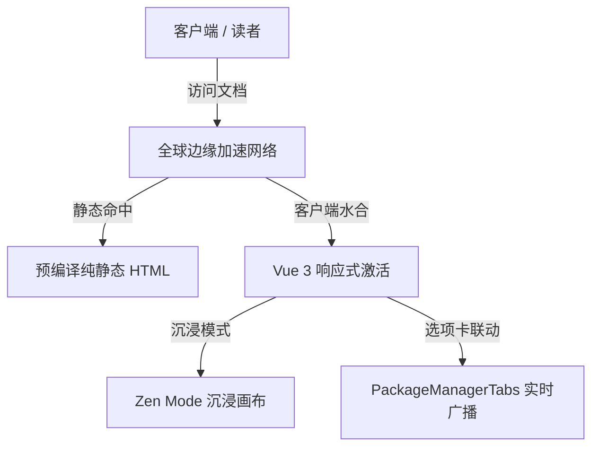
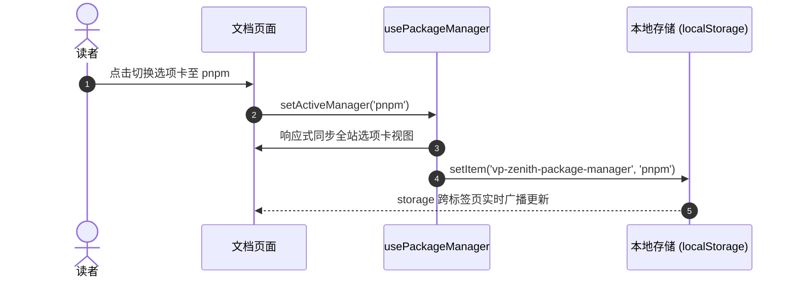

# 富媒体与可视化矩阵 (Rich Media Matrix)

VitePress Zenith 原生集成了 **LaTeX 数学公式**、**Mermaid 矢量图表**、**Markmap 交互思维导图** 与 **Medium-zoom 图片平滑缩放灯箱**，让专业技术文档与知识库获得顶级表现力。

---

## 一、LaTeX 数学公式 (MathJax)

得益于 VitePress 原生 `markdown.math: true` 配置，无需任何额外插件即可直接书写标准 LaTeX 语法。

### 1. 行内公式 (Inline Math)

在段落中使用单个 `$` 包裹公式：
- 欧拉恒等式：$e^{i\pi} + 1 = 0$
- 质能方程：$E = mc^2$
- 高斯积分：$\int_{-\infty}^{\infty} e^{-x^2} dx = \sqrt{\pi}$

### 2. 块级独立公式 (Block Math)

使用双 `$$` 包裹独立居中的复杂公式推导：

$$
f(x) = \frac{1}{\sigma \sqrt{2\pi}} \exp\left( -\frac{1}{2}\left(\frac{x-\mu}{\sigma}\right)^{\!2} \right)
$$

麦克斯韦方程组微分形式：

$$
\begin{aligned}
\nabla \cdot \mathbf{E} &= \frac{\rho}{\varepsilon_0} \\
\nabla \cdot \mathbf{B} &= 0 \\
\nabla \times \mathbf{E} &= -\frac{\partial \mathbf{B}}{\partial t} \\
\nabla \times \mathbf{B} &= \mu_0 \mathbf{J} + \mu_0 \varepsilon_0 \frac{\partial \mathbf{E}}{\partial t}
\end{aligned}
$$

---

## 二、Mermaid 架构与时序图

直接在 Markdown 中书写 ````mermaid 代码块，系统自动编译为深浅主题自适应的矢量 SVG。

### 1. 系统架构流程图 (Flowchart)



### 2. 跨页面状态同步时序图 (Sequence Diagram)



---

## 三、Markmap 交互思维导图

书写标准 Markdown 标题与无序列表，直接在 ````markmap 代码块中动态渲染为支持**缩放**、**平移拖拽**与**节点点击折叠**的交互式脑图：

```markmap
# VitePress Zenith 知识矩阵
## 核心基建
- VitePress 1.6+ 极速引擎
- Vue 3.5 响应式系统
- TypeScript 5.7 类型约束
- UnoCSS 原子化与图标库
## 沉浸式阅读
- 快捷键 Alt + Z
- 双向硬件加速展翼动效
- 1180px 黄金宽屏画布
- 顶部阅读进度指示条
## 富媒体矩阵
- LaTeX / MathJax 公式
- Mermaid 流程与时序图
- Markmap 动态思维导图
- Medium-zoom 点击缩放灯箱
## 开发者体验 (DX)
- Shiki Twoslash 动态类型悬浮
- PackageManagerTabs 全站跨页联动
```

右上角内置便捷工具栏，支持一键放大、缩小与适应画布居中。

---

## 四、Medium-zoom 图片平滑缩放灯箱

正文中的所有插图均自动集成 Medium 风格的平滑灯箱预览，点击插图即可进入聚焦大图模式，再次点击或滚动页面即可平滑复原：

<div style="text-align: center; margin: 24px 0;">
  
  <p style="font-size: 13px; color: var(--vp-c-text-2); margin-top: 8px;">点击上方插图体验平滑缩放与背景模糊灯箱</p>
</div>

若某些装饰性图标或小图不需要点击放大，只需在标签上添加 `class="no-zoom"` 即可自动排除。
