# 富媒体与可视化矩阵 (Rich Media Matrix)

VitePress Zenith 原生集成了 **LaTeX 数学公式**、**Mermaid 专业矢量图表（流程图、时序图、甘特图、Git分支图、状态机、类图、ER图、饼图、旅程图）**、**Markmap 交互思维导图** 与 **Medium-zoom 图片平滑缩放灯箱**，让专业技术文档与知识库获得顶级表现力。

---

## 一、LaTeX 数学公式 (MathJax)

得益于 VitePress 原生 `markdown.math: true` 配置，无需任何额外插件即可直接书写标准 LaTeX 语法。

### 1. 行内公式 (Inline Math)

在段落中使用单个 `$` 包裹公式：
- 欧拉恒等式：$e^{i\pi} + 1 = 0$
- 质能方程：$E = mc^2$
- 高斯积分：$\int_{-\infty}^{\infty} e^{-x^2} dx = \sqrt{\pi}$

### 2. 块级独立公式 (Block Math)

使用双 `$$` 包裹独立居中的复杂公式推导：

$$
f(x) = \frac{1}{\sigma \sqrt{2\pi}} \exp\left( -\frac{1}{2}\left(\frac{x-\mu}{\sigma}\right)^{\!2} \right)
$$

麦克斯韦方程组微分形式：

$$
\begin{aligned}
\nabla \cdot \mathbf{E} &= \frac{\rho}{\varepsilon_0} \\
\nabla \cdot \mathbf{B} &= 0 \\
\nabla \times \mathbf{E} &= -\frac{\partial \mathbf{B}}{\partial t} \\
\nabla \times \mathbf{B} &= \mu_0 \mathbf{J} + \mu_0 \varepsilon_0 \frac{\partial \mathbf{E}}{\partial t}
\end{aligned}
$$

---

## 二、Mermaid 架构与时序图

直接在 Markdown 中书写 ````mermaid 代码块，系统自动编译为深浅主题自适应的矢量 SVG。

### 1. 双轨对称系统架构流程图 (Symmetrical Architecture)

测试双轨分支与汇聚结构，展示各层级节点在卡片容器内的**绝对水平居中**与圆角矩形自适应舒展：

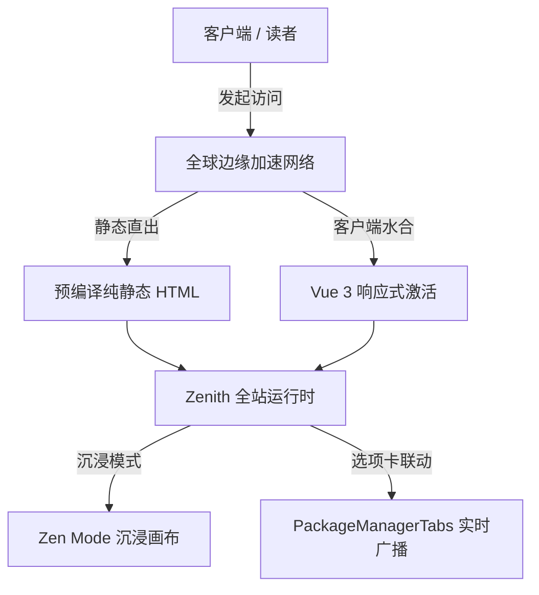

### 2. 条件决策与双向分流流程图 (Decision Flowchart)

测试菱形决策节点 `{...}`、判断分支标签、对称双向分流与汇聚对齐：

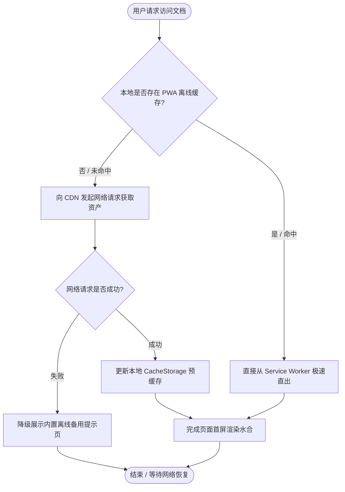

### 3. 横向全链路构建流水线 (Horizontal Pipeline)

测试横向排版（`flowchart LR`）下长词节点（如 `TypeScript 严格类型检查`、`PWA 离线 Service Worker 注入`）的水平居中与宽度延展：


### 4. 模块容器分层与子图架构 (Subgraphs & Multi-Layer System)

测试多子图（`subgraph`）嵌套容器在页面卡片中的居中对齐、跨层连线及圆柱体存储节点 `[(...)]`：

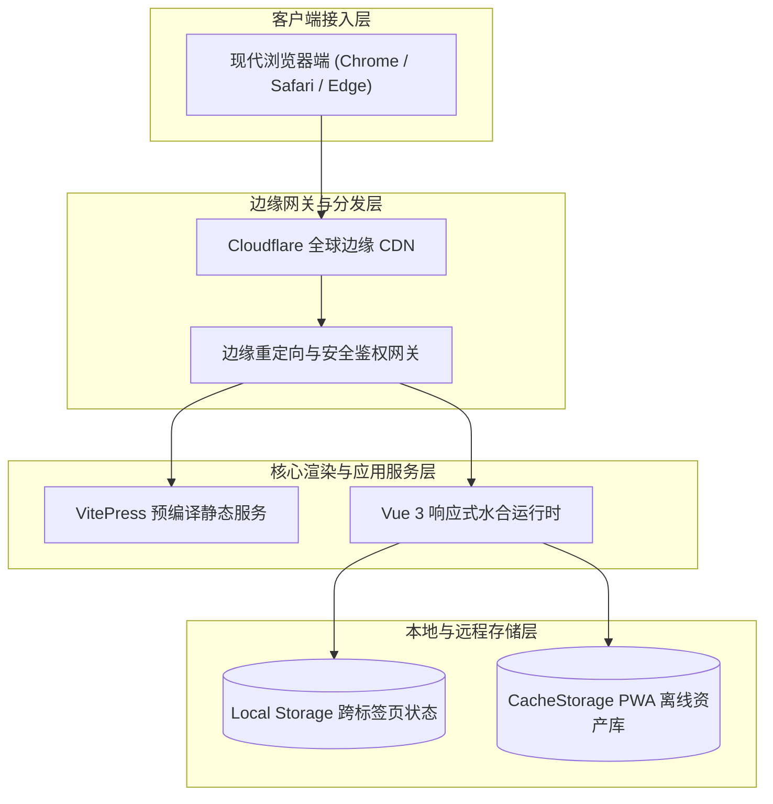

### 5. 文本长度与节点多形态极限测试矩阵 (Boundary Test Matrix)

测试单字短词、超长中英混合术语、显式换行 `<br/>` 标签以及六边形 <code v-pre>{{...}}</code>、梯形 `[/.../]` 等多样化几何节点的居中与内边距对称性：

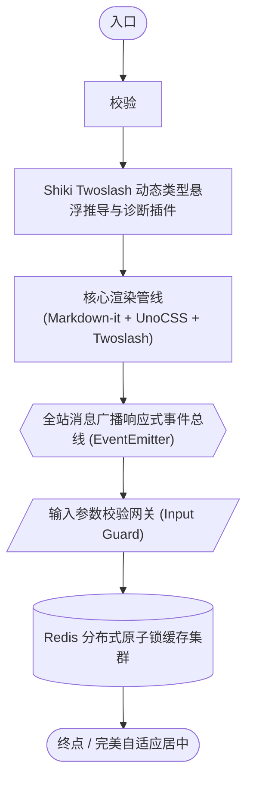

### 6. 跨页面状态同步时序图 (Sequence Diagram)

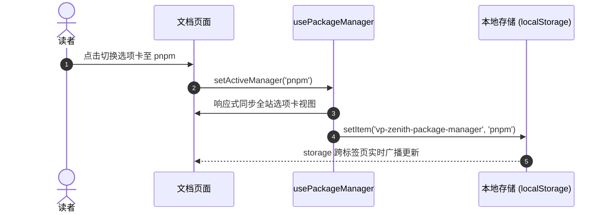

---

## 三、Mermaid 专业图表进阶实战 (Advanced Diagrams)

除基础流程图与时序图外，系统原生深度支持**甘特图**、**Git 分支演进图**、**系统状态机**、**架构类图**、**实体关系图 (ERD)**、**多维占比饼图**与**全链路用户旅程图**，直接在 ````mermaid 代码块中声明即可自适应全站深浅主题：

### 1. 项目迭代甘特图 (Gantt Chart)

用于展示多阶段研发迭代排期、关键里程碑路径与任务并行进度：

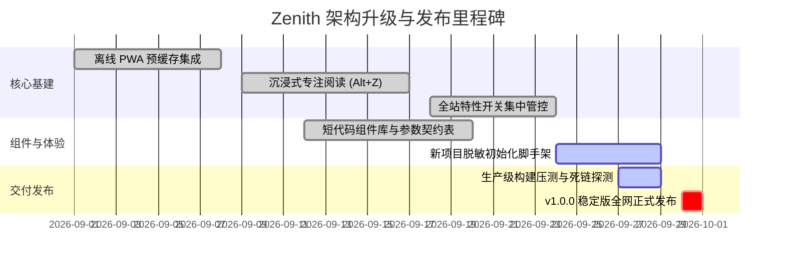

### 2. Git 分支演进与发布流水线图 (Git Graph)

用于直观表达团队分支协作规范（Git Flow）、功能集成分支与版本发布流向：

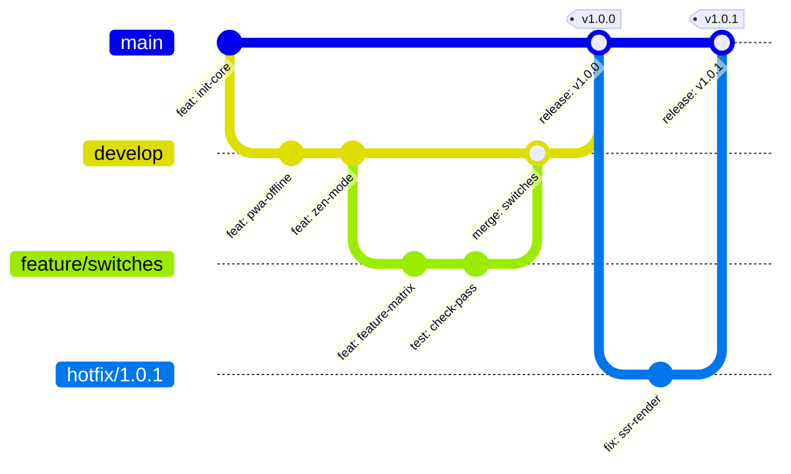

### 3. 系统状态机与生命周期流转图 (State Diagram)

用于清晰定义复杂业务实体、文档生命周期或订单状态的流转边界与前置守卫：

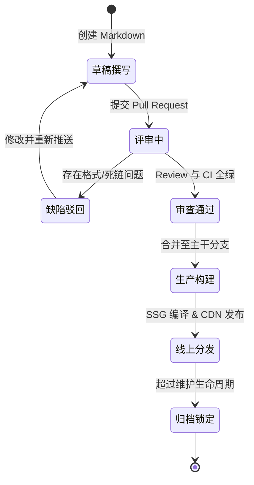

### 4. 面向对象与架构类继承图 (Class Diagram)

用于梳理系统的核心类、抽象接口、依赖注入与继承层级：

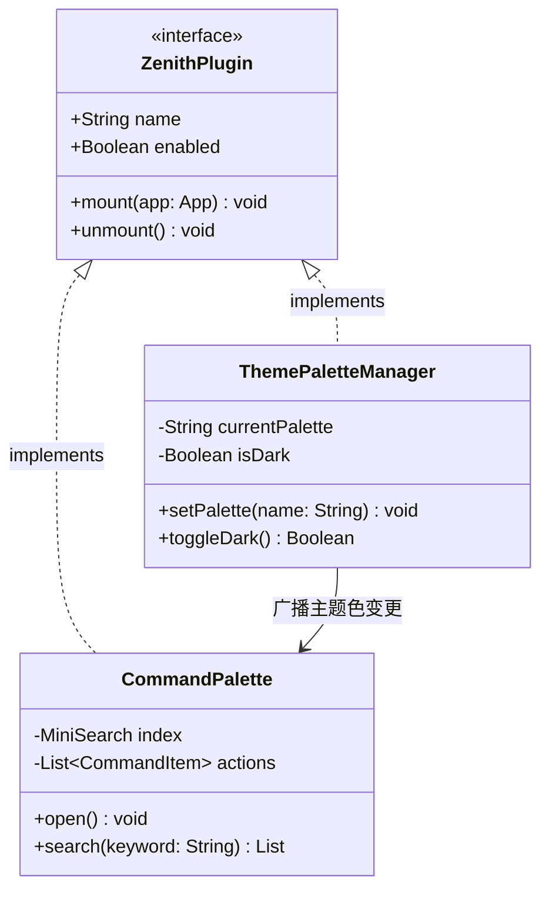

### 5. 数据实体关系图 (Entity-Relationship Diagram / ERD)

直观表达数据库表结构设计、外键引用与一对多/多对多实体关联：

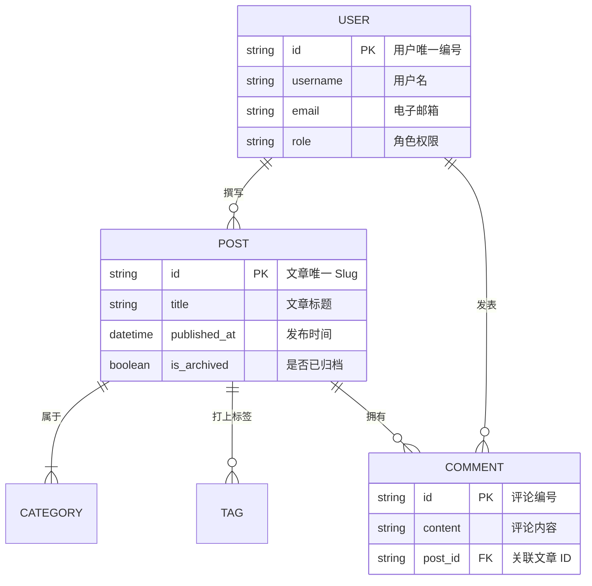

### 6. 多维业务占比饼图 (Pie Chart)

直观呈现数据分布构成、模块代码篇幅或业务权重：

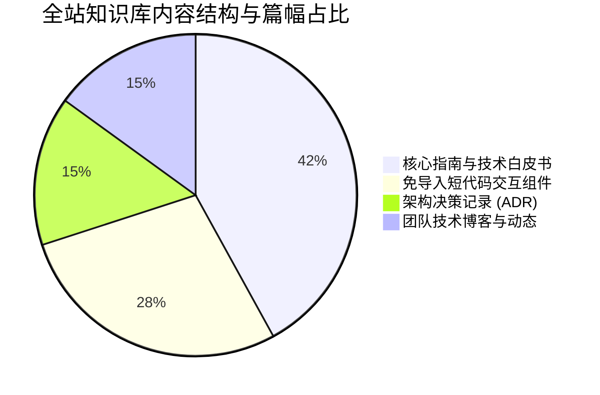

### 7. 用户全链路行为旅程图 (User Journey)

以时间线与满意度打分形式，可视化读者或开发者的端到端使用旅程：

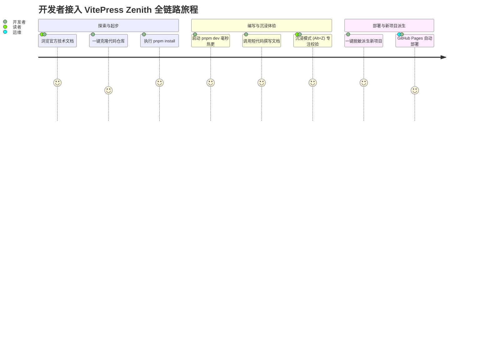

---

## 四、Markmap 交互思维导图

书写标准 Markdown 标题与无序列表，直接在 ````markmap 代码块中动态渲染为支持**缩放**、**平移拖拽**与**节点点击折叠**的交互式脑图：

```markmap
# VitePress Zenith 知识矩阵
## 核心基建
- VitePress 1.6+ 极速引擎
- Vue 3.5 响应式系统
- TypeScript 5.7 类型约束
- UnoCSS 原子化与图标库
## 沉浸式阅读
- 快捷键 Alt + Z
- 双向硬件加速展翼动效
- 1180px 黄金宽屏画布
- 顶部阅读进度指示条
## 富媒体矩阵
- LaTeX / MathJax 公式
- Mermaid 流程与时序图
- Markmap 动态思维导图
- Medium-zoom 点击缩放灯箱
## 开发者体验 (DX)
- Shiki Twoslash 动态类型悬浮
- PackageManagerTabs 全站跨页联动
```

右上角内置便捷工具栏，支持一键放大、缩小与适应画布居中。

---

## 五、Medium-zoom 图片平滑缩放灯箱

正文中的所有插图均自动集成 Medium 风格的平滑灯箱预览，点击插图即可进入聚焦大图模式，再次点击或滚动页面即可平滑复原：

<div style="text-align: center; margin: 24px 0;">
  
  <p style="font-size: 13px; color: var(--vp-c-text-2); margin-top: 8px;">点击上方插图体验平滑缩放与背景模糊灯箱</p>
</div>

若某些装饰性图标或小图不需要点击放大，只需在标签上添加 `class="no-zoom"` 即可自动排除。

---

> [!TIP] **进阶媒体管理**
> 想要了解图片相对路径与 Public 静态目录选型规范、深浅色模式双图自适应及 B站/YouTube/MP4 视频播放短代码组件？详见 [图片与多媒体资产管理 (Media Assets)](./media-assets.md)。

