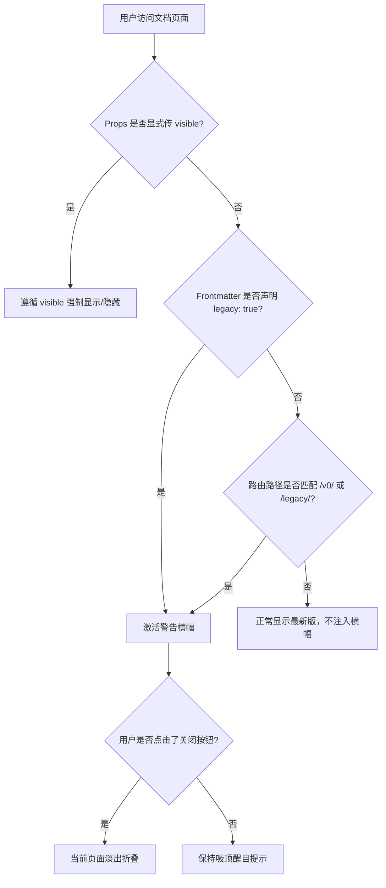

# 多版本文档管理与归档警告 (Version Switcher)

在大型开源框架、严肃基础库及企业级软件产品的全生命周期中，随着大版本的不停更迭（如 `v1.x`、`v2.x`），文档不可避免地需要面临**多版本共存、历史版本归档与长期维护 (LTS)** 的挑战。

如果缺乏健全的多版本管理体系，读者极易因搜索引擎索引进入废弃的历史版本文档，导致照搬已过时的 API 进而引发线上故障。

**VitePress Zenith** 提供了工业级且开箱即用的多版本管理解决方案：
1. **顶栏多版本下拉切换菜单**：清晰呈现当前最新稳定版、历史归档版本及更新日志变更入口。
2. **自动化历史归档警告横幅 (`<VpLegacyBanner>`)**：智能感知路由与页面 Frontmatter 标识，自动在历史文档顶端注入高亮警示条，提醒读者并提供一键跳转最新稳定版。
3. **等价路径智能推导**：横幅自动计算历史路径对应的最新版等价页面，实现无感平滑迁移。

---

## 交互效果演示

下面是 `<VpLegacyBanner>` 警告横幅在页面正文中的实际渲染效果（支持自定义版本号、文案与跳转目标）：

<VpLegacyBanner
  :visible="true"
  current-version="v0.9.0"
  latest-version="v1.0.0"
  latest-link="/guide/what-is-zenith"
  title="历史归档版本提示演示"
  message="这是一条模拟的历史旧版归档警告，提示读者该版本 API 已停止维护，建议立刻查阅最新版。"
  button-text="体验一键前往最新版"
/>

::: tip 实际场景自动化触发
在实际项目中，您无需在每个旧版 Markdown 中手动放置该组件。当文档的路径匹配 `/v0/` 或 Frontmatter 中标注了 `legacy: true` 时，全局布局会在标题正上方**自动注入**该警告横幅。您也可以亲自点击顶栏版本切换菜单访问 [v0.9.0 历史归档样例页面](/v0/guide/) 观察真实页面级表现。
:::

---

## 核心特性设计

### 1. 顶栏版本下拉菜单

在 `docs/.vitepress/config.ts` 的 `themeConfig.nav` 中，通过 VitePress 原生嵌套导航项构建版本矩阵：

```ts
// docs/.vitepress/config.ts
export default defineConfig({
  themeConfig: {
    nav: [
      { text: '首页', link: '/' },
      { text: '指南', link: '/guide/what-is-zenith' },
      {
        text: 'v1.0.0',
        items: [
          {
            text: '当前版本',
            items: [
              { text: 'v1.0.0 (最新稳定版)', link: '/guide/what-is-zenith' },
            ],
          },
          {
            text: '历史归档',
            items: [
              { text: 'v0.9.0 (旧版归档)', link: '/v0/guide/' },
            ],
          },
          {
            text: '版本变更',
            items: [
              { text: '多版本管理指南', link: '/guide/version-switcher' },
              { text: '更新日志 (Changelog)', link: 'https://github.com/zenith/vitepress-zenith/releases' },
            ],
          },
        ],
      },
    ],
  },
})
```

---

### 2. 双重触发感知机制

`<VpLegacyBanner>` 采用双重智能探测机制，确保历史版本文档零遗漏、零侵入被捕获：



#### 方式一：Frontmatter 元数据声明

在历史版本的 Markdown 文件顶部头部，声明 `legacy: true`：

```markdown
---
title: v0.9.0 历史指引
legacy: true
version: v0.9.0
latestLink: /guide/what-is-zenith
---

# v0.9.0 历史指引
正文内容...
```

#### 方式二：目录路由自动识别

如果您的旧版文档集中存放在特定历史目录（例如 `docs/v0/` 或路径包含 `/archived/`、`/legacy/`、`/v0.x/`），组件会通过正则引擎自动捕获当前路由，并自动提取当前版本号标签。

---

### 3. 等价目标路径智能推导

当读者正在查阅 `https://your-docs.com/v0/guide/deploy.html` 时，横幅右侧的升级按钮会自动推导出最新版等价页面：

$$\text{历史路由: } \texttt{/v0/guide/deploy} \xrightarrow{\quad\text{智能平移推导}\quad} \text{最新稳定版: } \texttt{/guide/deploy}$$

如果读者查阅的旧版页面在新版中已重命名或迁移，可通过 Frontmatter 的 `latestLink` 进行精确覆盖：

```yaml
---
latestLink: /guide/migration-v1
---
```

---

## 组件 API 契约

`<VpLegacyBanner>` 对外开放了丰富的属性与样式覆盖能力：

<VpApiTable>
  <VpApiItem
    name="visible"
    type="boolean"
    default="undefined"
    description="强制控制横幅的显隐状态。未配置时将自动根据当前路由路径与页面 Frontmatter 规则推导。"
  />
  <VpApiItem
    name="currentVersion"
    type="string"
    default="'v0.9.0'"
    description="当前历史归档版本号。支持从 Frontmatter 的 version 字段或当前 URL 路径正则提取。"
  />
  <VpApiItem
    name="latestVersion"
    type="string"
    default="'v1.0.0'"
    description="最新稳定版目标版本号，展示在引导跳转按钮中。"
  />
  <VpApiItem
    name="latestLink"
    type="string"
    default="'/guide/what-is-zenith'"
    description="点击跳转的最新稳定版文档链接。若未指定且处于历史路由，将自动平移至对应等价路径。"
  />
  <VpApiItem
    name="title"
    type="string"
    default="'历史归档版本提示'"
    description="警告横幅顶部加粗标题，支持随站点当前语言自动切换中英文。"
  />
  <VpApiItem
    name="message"
    type="string"
    default="详细警告描述"
    description="提示读者的具体警告正文，告知旧版 API 停维与迁移建议。"
  />
  <VpApiItem
    name="buttonText"
    type="string"
    default="'前往最新稳定版 (v1.0.0) →'"
    description="跳转操作按钮的主文案，点击后平滑跳转目标文档。"
  />
  <VpApiItem
    name="dismissible"
    type="boolean"
    default="true"
    description="是否允许读者点击右上角关闭按钮暂时折叠此提示。"
  />
</VpApiTable>

---

## 生产级多版本部署策略

在严肃团队的实际演进中，多版本文档通常有以下两种架构方案：

| 部署架构 | 适用场景 | 优势与收益 | Zenith 适配机制 |
| :--- | :--- | :--- | :--- |
| **单仓目录隔离式** | 中小型项目、版本差异在 3 个以内 | 零运维成本，单次构建全量输出，单域名无需配置反向代理 | `sidebar.ts` 忽略扫描 + 独立配置 `/v0/` 侧边栏分组 |
| **独立构建与反代分发式** | 大型单体或微前端开源生态（如 Vue 2 与 Vue 3） | 各版本依赖完全解耦，历史版本永久冻结无需重新打包 | 独立子目录部署，顶栏版本菜单链接直接指向独立部署路径 |

通过以上全链路协同，VitePress Zenith 让开源文档的生命周期管理兼具专业性与舒适体验。
